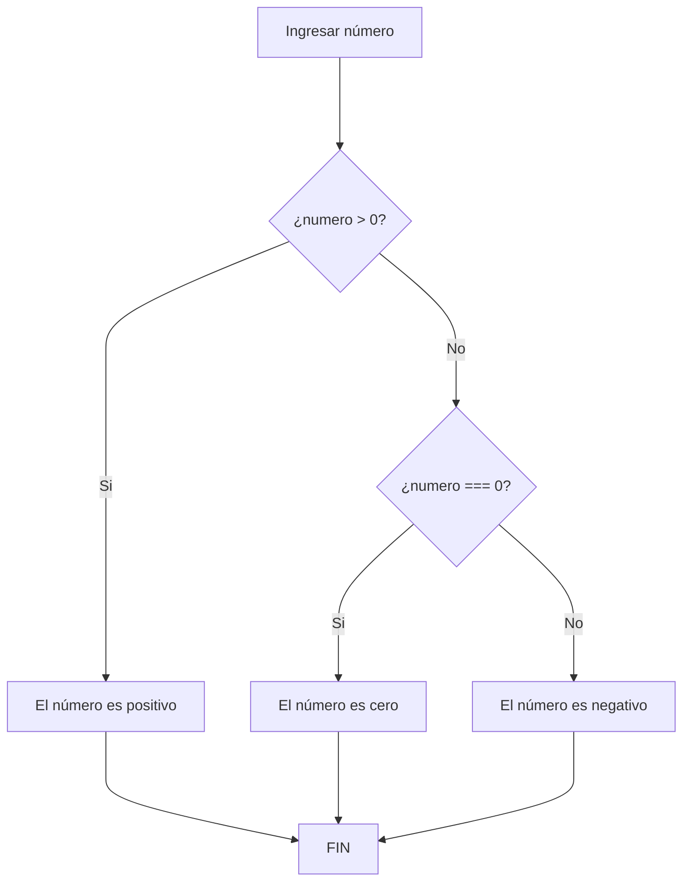
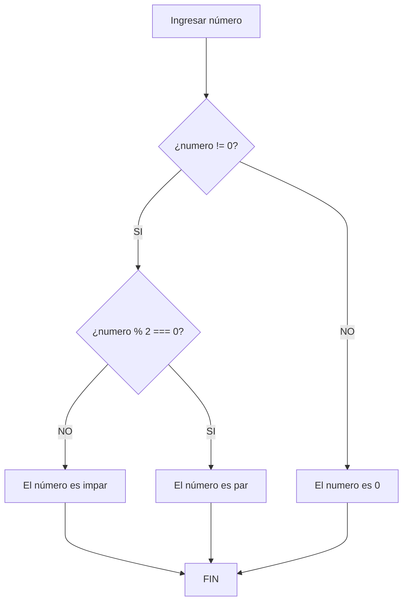

# Estructuras-de-control
## Ejercicio 1 
Crea un programa que lea un número entero del usuario y lo clasifique como positivo, negativo o cero.

## Ejercicio 2
Crea un programa que lea un número entero del usuario y muestre un mensaje indicando si es par o impar.

